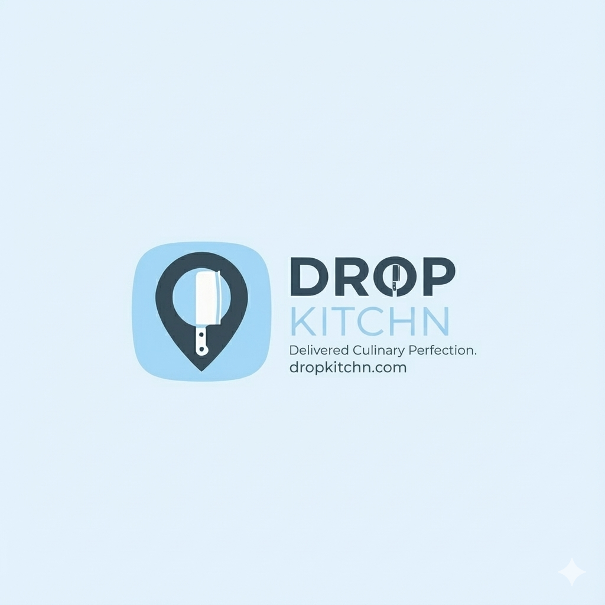

# DropKitchn

  
   
  <h3>Fixing someone else's kitchen.</h3>
  <a href="https://dropkitchn.com"><strong>dropkitchn.com »</strong></a>
    

---

## 👋 What is this?

**DropKitchn** is a logistics experiment born from a simple question: **Why do nice vacation rentals always have terrible knives?**

We love traveling and we love cooking meals with friends, but we're tired of ruining expensive local ingredients because the "luxury" rental only had a dull IKEA knife and a scratched-up Teflon pan.

We're building a system to ship professional-grade cooking gear directly to rentals, so you don't have to check a bag full of kitchen tools just to make Thanksgiving dinner.

## 🛑 The Problem

If you've stayed in a short term rental you know the struggle:
* Every drawer contains six ladels, 14 wine screws and not a single bread knife.
* The knives are dangerously dull.
* The pans are warped or peeling.
* You spend half your vacation trying to figure out if they own a can opener.

It forces you to choose: **Pack your own gear** :rage: or **deal with it** :disappointed:.

## ⚡ The Experiment

We're testing a real kitchen kit for the vacation cook. We drop a bomb-proof case on the doorstep containing exactly what you need to actually perform in the kitchen.

**The "Golden Kit" (Current Alpha Build):**
* 📦 **The Box:** Lockable, shippable, indestructible.
* 🔪 **The Steel:** Professional knives (Chef, Serrated, Paring). Sharp enough to shave with.
* 🍳 **The Pan:**  Metal-utensil safe and non-stick.
* 🧼 **The Promise:** It shows up clean, sharp, and ready to go.

## 📂 What's in this Repo?

This is where we are documenting the build, the logic, and the digital side of this physical experiment.
